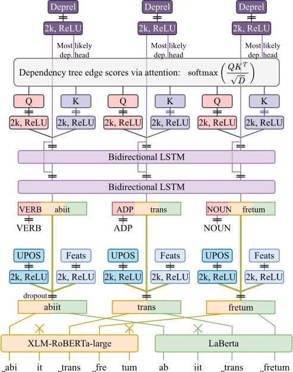

# ÚFAL LatinPipe at EvaLatin 2024: Morphosyntactic Analysis of Latin

This repository will contain the LatinPipe parser implementation described in
the _ÚFAL LatinPipe at EvaLatin 2024: Morphosyntactic Analysis of Latin_ paper.
The code will be published before the LT4HALA 2024 workshop, collocated with LREC-COLING 2024 in May 2024.

---



<h3 align="center"><a href="https://arxiv.org/abs/2404.05839">ÚFAL LatinPipe at EvaLatin 2024: Morphosyntactic Analysis of Latin</a></h3>

<p align="center">
  <b>Milan Straka</b> and <b>Jana Straková</b> and <b>Federica Gamba</b><br>
  Charles University<br>
  Faculty of Mathematics and Physics<br>
  Institute of Formal and Applied Lingustics<br>
  Malostranské nám. 25, Prague, Czech Republic
</p>

**Abstract:** We present LatinPipe, the winning submission to the EvaLatin 2024
Dependency Parsing shared task. Our system consists of a fine-tuned
concatenation of base and large pre-trained LMs, with a dot-product attention
head for parsing and softmax classification heads for morphology to jointly
learn both dependency parsing and morphological analysis. It is trained by
sampling from seven publicly available Latin corpora, utilizing additional
harmonization of annotations to achieve a more unified annotation style. Before
fine-tuning, we train the system for a few initial epochs with frozen weights.
We also add additional local relative contextualization by stacking the BiLSTM
layers on top of the Transformer(s). Finally, we ensemble output probability
distributions from seven randomly instantiated networks for the final
submission. The code is available at <a href="https://github.com/ufal/evalatin2024-latinpipe">https://github.com/ufal/evalatin2024-latinpipe</a>.<br clear="both">

---

## Content of this Repository

- The directory `data` is for all the required data (UD 2.13 data, harmonized
  PROIEL, Sabellicus, Archimedes Latinus, EvaLatin 2024 test data).
  - The script `data/fetch_data.sh` downloads and extracts all the data.

- The `latinpipe_evalatin24.py` is the LatinPipe EvaLatin24 source.
  - It depends on `latinpipe_evalatin24_eval.py`, which is a modularized version
    of the official evaluation script.

- The `latinpipe_evalatin24_server.py` is a REST server with UDPipe-2-compatible
  API, using `latinpipe_evalatin24.py` to perform tagging and parsing.

## Training a Model

To train a model on all data, you should
1. run the `data/fetch_data.sh` script to download all required data,
2. create a Python environments with the packages listed in `requirements.txt`,
3. train the model itself using the `latinpipe_evalatin24.py` script.

   To train a model performing UPOS/UFeats tagging, lemmatization, and
   dependency parsing, we use
   ```sh
   la_ud213_all="la_ittb la_llct la_perseus la_proiel la_udante"
   la_other="la_archimedes la_sabellicus"
   transformer="bowphs/PhilBerta"  # or bowphs/LaBerta

   udpipe_evalatin24k.py $(for split in dev test train; do echo --$split; for tb in $la_ud213_all; do [ $tb-$split = la_proiel-train ] && tb=la_proielh; echo data/$tb/$tb-ud-$split.conllu; done; done) $(for tb in $la_other; do echo data/$tb/$tb-train.conllu; done) --transformers $transformer --epochs=30 --exp=evalatin24_model --subword_combination=last --epochs_frozen=10 --batch_size=64 --save_checkpoint
   ```

## Predicting with a Trained Model

To predict with a trained model, you can use the following command:
```sh
latinpipe_evalatin24.py --load evalatin24_model/model.weights.h5 --exp target_directory --test input1.conllu input2.conllu
```
- the outputs are generated in the target directory, with a `.predicted.conllu` suffix;
- if you want to also evaluate the predicted files, you can use `--dev` option instead of `--test`.

---

## Contact

Milan Straka: ``straka@ufal.mff.cuni.cz``\
Jana Straková: ``strakova@ufal.mff.cuni.cz``\
Federica Gamba: ``gamba@ufal.mff.cuni.cz``
